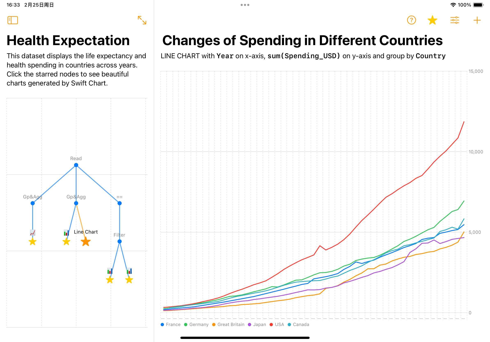
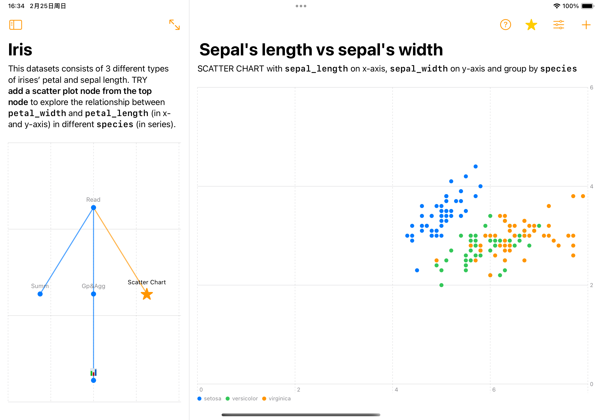
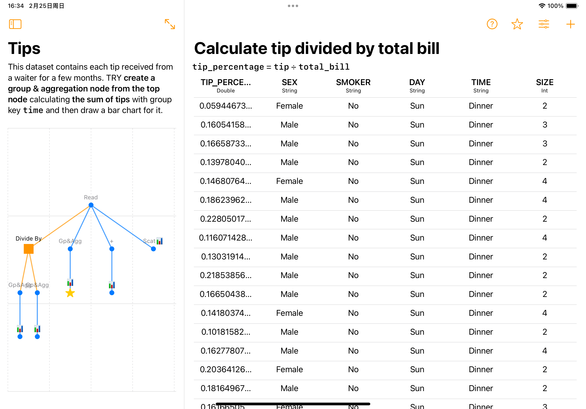

# Route of Data - WWDC 24 Swift Student Challenge Winner

Route of Data is a data analysis app that focuses on the processes of data handling and visualization. It boasts a user-friendly interface that simplifies the journey away from repetitive data handling tasks.

Imagine, with just a few clicks, your data is like cargo loaded onto a truck, efficiently reaching its destination (the analysis result charts) along a preset route (data processing workflow).

The core feature of this app is the "Route" function, which allows you to save the entire data processing process so that you can use the same workflow to analyze new data in the future. Simply by changing the data source, you can automatically generate a new analysis report, greatly saving time and effort.

Route of Data is built with three frameworks. The simple and user-friendly SwiftUI framework enabled me to quickly set up an attractive UI. TabularData is the core framework for data processing. Finally, Swift Chart framework allows users to create beautiful data visualization charts, including pie charts, bar charts, line charts, and scatter plots. Additionally, I used the Swift Chart framework to construct the navigation UI that displays different nodes within a "Route".

## Screenshots

## Other text content in other submission forms

### Beyond the Swift Student Challenge

> (If you've used your coding skills to support your community or an organization in your area, let us know.)

My programming skills have been immensely beneficial in my past roles across various organizations.

During an internship, I utilized data analysis scripts to assist my mentor with data processing, significantly speeding up the process and earning accolades.

In my undergraduate days, while working for the school's news agency, I developed a social media robotic application that resolved the team's file-sharing issues.

Later, I self-taught Swift and SwiftUI online and created a gaming tool app for my friends. This app later achieved numerous downloads and received positive feedback from the gaming community online, which was incredibly gratifying for me.

### Apps on the App Store

My works on the App Store primarily include Genshin Pizza Helper, HSR Pizza Helper, and DebitCredit.

Genshin Pizza Helper and HSR Pizza Helper are game tool apps I designed and developed, catering to players of Genshin Impact and Honkai: Star Rail, respectively, with a focus on widgets. Both apps have been warmly received by users, amassing a combined total of over 500,000 downloads, with daily active users exceeding 50,000. They have garnered over 20,000 App Store ratings, maintaining an impressive score of 4.9 to this day.

DebitCredit was my award-winning entry in the WWDC2023 Student Challenge. It is an accounting app based on double-entry bookkeeping that allows individuals without accounting knowledge to manage their finances using this powerful tool, as well as to aid in learning accounting concepts.

### Comments

I am a master student majoring in Analytics, currently enrolled at the University of Southern California. In class, I've learned many methods of data processing and analysis. However, these methods require the use of programming languages such as Python or R, which can be too difficult for the average person. Therefore, I conceived the idea of developing an app to lower the barriers to data analysis.

The inspiration for this app came from my internship experience, where I had to process data with the same structure through repetitive operations every week to write a weekly report. My mentor taught me to use Excel, but data processing with Excel was time-consuming and inefficient, and could not be reused. Later, I wrote some Python scripts for it which successfully reduced my load. However, programming languages were overly complex to common people.

Route of Data was created in response to these challenges. Unlike using Excel or other data processing scripts, Route of Data helps user to construct reusable data processing workflow. Besides, the app also utilized Swift Chart clearly presenting the data processing journey to users, which is more clear for data analyzer.

### Other content

I used some public datasets solely for demonstration purposes, and I have adhered to the licenses of these datasets. Below are the sources of these datasets:

- air_quality_no2.csv and air_quality_pm25.csv - https://github.com/pandas-dev/pandas
- car_crashes.csv - https://www.kaggle.com/datasets/fivethirtyeight/fivethirtyeight-bad-drivers-dataset
- healthexp.csv - https://ourworldindata.org/grapher/life-expectancy-vs-health-expenditure
- iris.csv - https://archive.ics.uci.edu/dataset/53/iris
- mpg.csv - https://data.world/dataman-udit/cars-data
- penguins.csv - https://github.com/allisonhorst/palmerpenguins
- taxis.csv - https://www.nyc.gov/site/tlc/about/tlc-trip-record-data.page
- tips.csv - https://rdrr.io/cran/reshape2/man/tips.html